# The Complete Vector Databases Guide

### A Practical Handbook for AI Engineers - From Embeddings to Production

---

> **Audience:** Developers who already know basic Python but have never worked
> with vector databases, embeddings, or Retrieval-Augmented Generation (RAG)
> before.
>
> **Goal:** By the end of this guide, you will understand what vector
> databases are, how semantic search and RAG work end-to-end, how Chroma,
> Pinecone, and Qdrant compare, and how to design, secure, and deploy a
> production-ready AI search system.

---

## Table of Contents

1. [Introduction](#1-introduction)
2. [Embeddings](#2-embeddings)
3. [Semantic Search](#3-semantic-search)
4. [Similarity Search](#4-similarity-search)
5. [Retrieval-Augmented Generation (RAG)](#5-retrieval-augmented-generation-rag)
6. [Chunking](#6-chunking)
7. [Metadata](#7-metadata)
8. [Vector Indexing](#8-vector-indexing)
9. [Chroma](#9-chroma)
10. [Pinecone](#10-pinecone)
11. [Qdrant](#11-qdrant)
12. [Compare Chroma vs Pinecone vs Qdrant](#12-compare-chroma-vs-pinecone-vs-qdrant)
13. [LangChain Integration](#13-langchain-integration)
14. [FastAPI Integration](#14-fastapi-integration)
15. [OpenAI Responses API Integration](#15-openai-responses-api-integration)
16. [Production Architecture](#16-production-architecture)
17. [Security Best Practices](#17-security-best-practices)
18. [Performance Optimization](#18-performance-optimization)
19. [Scaling](#19-scaling)
20. [Deployment](#20-deployment)
21. [Repository Structure](#21-repository-structure)
22. [Common Mistakes](#22-common-mistakes)
23. [FAQ](#23-faq)
24. [Best Practices Checklist](#24-best-practices-checklist)
25. [Learning Roadmap](#25-learning-roadmap)
26. [Further Resources](#26-further-resources)

---

## 1. Introduction

### 1.1 What is a Vector Database?

A **vector database** is a specialized database designed to store, index, and
search high-dimensional numeric vectors - most commonly **embeddings**
produced by machine learning models. Instead of matching rows by exact
values (like `WHERE user_id = 42`), a vector database answers a different
kind of question:

> "Which stored items are most **similar in meaning** to this new item?"

Every piece of data - a sentence, a paragraph, an image, an audio clip - can
be converted into a vector: a fixed-length list of floating-point numbers
(e.g. `[0.021, -0.114, 0.876, ...]`, often 384 to 3072 numbers long). Vectors
that represent similar meanings end up positioned close together in this
numeric space. A vector database's core job is to store millions (or
billions) of these vectors and answer "nearest neighbor" queries extremely
fast.

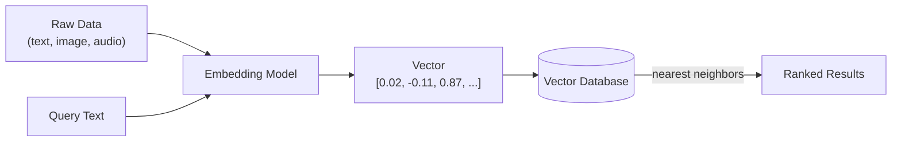

### 1.2 Why Vector Databases Exist

Traditional software was built to answer **exact** or **structured**
questions: "find the order with ID 8842" or "find all users who signed up
after March 1st." These questions map cleanly onto rows, columns, and
indexes like B-trees.

But a huge portion of real-world data - documents, support tickets, product
descriptions, images, chat transcripts - is **unstructured**, and the
questions people actually want to ask about it are about *meaning*, not
exact matches:

- "Which support tickets are about a similar billing issue?"
- "Which product looks like this photo?"
- "Which paragraph in our documentation answers this customer's question?"

Keyword search partially solves this, but it fails when the wording differs
from the source text (e.g. searching "cheap flights" won't match a document
that only says "affordable airfare"). Vector databases solve this by
comparing *meaning*, encoded as geometry, rather than exact text.

### 1.3 Traditional Databases vs Vector Databases

| Aspect | Traditional Database (SQL/NoSQL) | Vector Database |
|---|---|---|
| **Primary data type** | Structured rows, JSON documents | High-dimensional numeric vectors |
| **Query style** | Exact match, range queries, joins | Nearest-neighbor / similarity search |
| **Example query** | `SELECT * FROM orders WHERE total > 100` | "Find the 5 most similar passages to this question" |
| **Index structures** | B-tree, hash index, GIN | HNSW, IVF, PQ (covered in Section 8) |
| **Distance concept** | Not applicable | Cosine similarity, dot product, Euclidean distance |
| **Typical use cases** | Transactions, reporting, CRUD apps | Semantic search, recommendations, RAG, deduplication |
| **Consistency model** | Often strong (ACID) | Often eventually consistent, tuned for read speed |
| **Data growth pattern** | Rows added/updated individually | Vectors added in batches after embedding |

### 1.4 When to Use Each

| Use a traditional database when... | Use a vector database when... |
|---|---|
| You need exact filtering (`status = 'active'`) | You need "find things similar to X" |
| You need transactional guarantees (banking, orders) | You're building search, RAG, or recommendations |
| Your data is naturally tabular | Your data is unstructured (text, images, audio) |
| You need strong relational joins | You need to combine similarity + light metadata filters |

**In practice, most production AI systems use both together**: a
traditional database (Postgres, MySQL, SQLite) for structured application
data - users, documents metadata, permissions - and a vector database
specifically for the embeddings that power semantic search. This is exactly
the pattern used in this guide's examples.

## 2. Embeddings

### 2.1 What Embeddings Are

An **embedding** is a fixed-length vector of numbers that represents the
*meaning* of a piece of data. Think of it as translating a word, sentence,
image, or document into coordinates in a huge multi-dimensional map - a map
where distance represents semantic difference and closeness represents
semantic similarity.

For example, the sentences "The cat sat on the mat" and "A feline rested on
the rug" have almost no words in common, but a good embedding model will
place their vectors very close together, because their *meanings* are
nearly identical.

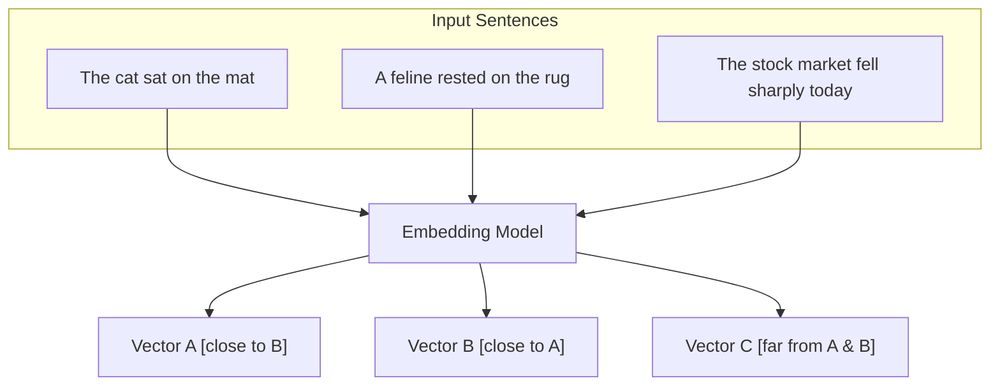

### 2.2 How Embeddings Are Generated

Embeddings come from neural network models trained on massive amounts of
text (or images, or audio) using a technique called **representation
learning**. During training, the model learns to place semantically related
items near each other in vector space, based on patterns like which words
appear in similar contexts.

You don't train these models yourself for most applications - you call an
existing pretrained model through an API or a local library:

```python
from openai import OpenAI

client = OpenAI()

response = client.embeddings.create(
    model="text-embedding-3-small",
    input="The cat sat on the mat."
)

vector = response.data[0].embedding
print(len(vector)) # 1536
print(vector[:5]) # [0.0123, -0.0456, 0.0891, ...]
```

### 2.3 Why Embeddings Work

Embedding models are trained so that the geometric relationships between
vectors reflect real semantic relationships. A famous illustration of this
(from early word-embedding research) is vector arithmetic:

```
vector("king") - vector("man") + vector("woman") ≈ vector("queen")
```

This works because the model has learned that the *direction* separating
"man" and "woman" in vector space consistently represents a gender-related
concept, and that same direction, applied to "king," lands near "queen."
Modern sentence- and document-level embedding models generalize this same
idea to entire paragraphs: the resulting vector encodes a compressed summary
of meaning, topic, tone, and context.

### 2.4 Vector Dimensions

The "dimension" of an embedding is simply how many numbers are in the
vector. More dimensions can capture more nuance, at the cost of more storage
and slower search.

| Model | Dimensions | Typical Use Case |
|---|---|---|
| `text-embedding-3-small` (OpenAI) | 1536 | General-purpose, cost-efficient |
| `text-embedding-3-large` (OpenAI) | 3072 | Higher accuracy, more storage/cost |
| `text-embedding-ada-002` (OpenAI, legacy) | 1536 | Older generation, still widely used |
| `all-MiniLM-L6-v2` (open-source, sentence-transformers) | 384 | Fast, lightweight, local/offline |
| `bge-large-en` (open-source) | 1024 | Strong open-source retrieval performance |

> **Rule of thumb:** higher dimensions generally improve retrieval quality
> up to a point, but increase storage size and search latency. Most teams
> start with a well-regarded 384-1536 dimension model and only move to
> larger models if retrieval quality genuinely requires it.

### 2.5 Similarity Between Vectors

Once data is represented as vectors, "similar meaning" becomes "vectors
that are close together," measured using a **distance** or **similarity
metric** (covered in depth in Section 4). The most common is **cosine
similarity**, which measures the angle between two vectors:

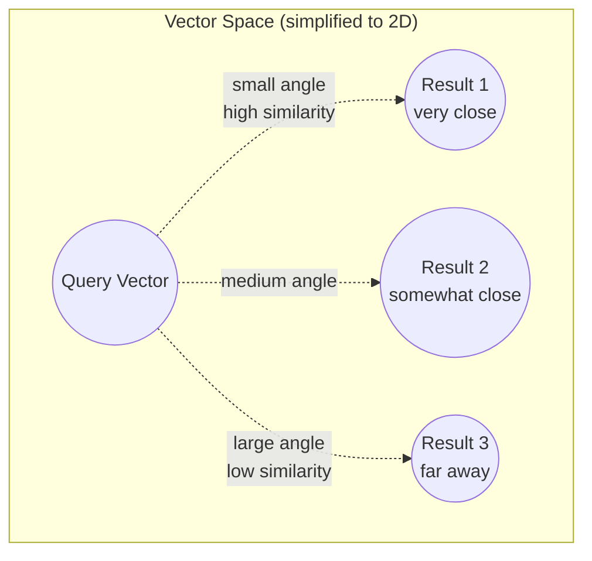

A vector database's entire job, at its core, is: given a query vector,
quickly find the `k` stored vectors with the highest similarity (or lowest
distance) - this is called **k-nearest-neighbor (k-NN) search**.

## 3. Semantic Search

### 3.1 Keyword Search

Keyword search (the classic approach, exemplified by tools like `grep` or
basic SQL `LIKE` queries) matches documents that contain the **exact words**
in a query. It's simple, fast, and predictable - but brittle. Searching
"car repair" will not match a document that only says "automobile
maintenance," even though they mean the same thing.

```sql
SELECT * FROM articles WHERE content LIKE '%car repair%';
```

### 3.2 Full-Text Search

Full-text search (e.g. PostgreSQL's `tsvector`, Elasticsearch, or
Algolia) improves on plain keyword search by adding:

- **Stemming** - matching "running" to "run"
- **Ranking** - scoring by term frequency (TF-IDF, BM25)
- **Tokenization** - handling punctuation, case, stop words

It's much better than raw keyword matching, but it still fundamentally
operates on words and their statistical patterns, not meaning. "cheap
flights" still won't reliably match "affordable airfare."

```sql
SELECT *, ts_rank(search_vector, query) AS rank
FROM articles, plainto_tsquery('english', 'car repair') query
WHERE search_vector @@ query
ORDER BY rank DESC;
```

### 3.3 Semantic Search

Semantic search embeds both the query and the documents into vectors, then
finds documents whose vectors are closest to the query's vector - capturing
meaning rather than exact wording.

```python
# 1. Embed the query
query_vector = embed("affordable airfare")

# 2. Search the vector database for nearest neighbors
results = vector_db.similarity_search(query_vector, top_k=5)

# 3. Results include documents about "cheap flights", "budget tickets",
#    "discount airline deals" - none of which share exact words with the query
```

### 3.4 Comparison

| Feature | Keyword Search | Full-Text Search | Semantic Search |
|---|---|---|---|
| Matches synonyms | ❌ No | ⚠️ Partial (via stemming) | ✅ Yes |
| Handles typos | ❌ No | ⚠️ Partial (fuzzy matching add-ons) | ✅ Often, via meaning |
| Understands context | ❌ No | ❌ No | ✅ Yes |
| Setup complexity | ✅ Very simple | ⚠️ Moderate | ⚠️ Moderate (requires embeddings + vector DB) |
| Compute cost | ✅ Very low | ✅ Low | ⚠️ Higher (embedding generation + ANN search) |
| Best for | Exact codes, IDs, precise terms | Traditional document/site search | Question answering, RAG, recommendations |
| Explainability | ✅ Very high | ✅ High | ⚠️ Lower ("why did this match?" is less obvious) |

### 3.5 Real-World Examples

| Scenario | Best Approach | Why |
|---|---|---|
| Searching for an order by order number | Keyword / exact match | Precision matters more than meaning |
| A blog's built-in search bar | Full-text search | Cheap, fast, good enough for most content sites |
| "What's our refund policy for damaged items?" against a support knowledge base | Semantic search | The user's wording rarely matches the doc's wording exactly |
| A customer support chatbot answering from internal docs (RAG) | Semantic search + LLM | Needs to retrieve relevant context regardless of phrasing |
| Legal document search where exact terminology matters | Hybrid (keyword + semantic) | Precision on terms of art, recall on paraphrased concepts |

> **Best practice:** many production systems combine semantic search with
> keyword/metadata filtering - this is called **hybrid search**, covered
> further in Sections 7 and 11.

## 4. Similarity Search

Similarity search is the mathematical operation underneath semantic search:
given a query vector, measure its distance or similarity to every stored
vector (or a smart subset of them - see Section 8), and return the closest
matches. There are three metrics you'll encounter constantly.

### 4.1 Cosine Similarity

Cosine similarity measures the **angle** between two vectors, ignoring
their magnitude (length). It ranges from `-1` (opposite meaning) to `1`
(identical direction/meaning).

**Formula:**

```
cosine_similarity(A, B) = (A · B) / (‖A‖ × ‖B‖)
```

Where `A · B` is the dot product and `‖A‖` is the magnitude (Euclidean
norm) of vector A.

```python
import numpy as np

def cosine_similarity(a, b):
    a, b = np.array(a), np.array(b)
    return np.dot(a, b) / (np.linalg.norm(a) * np.linalg.norm(b))

a = [0.2, 0.8, 0.1]
b = [0.25, 0.75, 0.15]
print(cosine_similarity(a, b))  # ~0.994 -> very similar
```

**When to use:** the default choice for most text embedding use cases,
because it's insensitive to vector magnitude - two vectors pointing in the
same direction are considered maximally similar regardless of length, which
matches how most embedding models are trained.

### 4.2 Dot Product

The dot product is the sum of the element-wise products of two vectors. It
is closely related to cosine similarity but is **sensitive to magnitude** -
longer vectors tend to produce larger dot products.

**Formula:**

```
dot_product(A, B) = Σ (A_i × B_i)
```

```python
def dot_product(a, b):
    return sum(x * y for x, y in zip(a, b))

print(dot_product([1, 2, 3], [4, 5, 6]))  # 32
```

**When to use:** when your embedding model was specifically trained/
normalized such that magnitude carries meaningful information (some
retrieval-optimized models are trained this way), or when vectors are
already L2-normalized - in that case dot product and cosine similarity
produce identical rankings, and dot product is computationally cheaper.

### 4.3 Euclidean Distance

Euclidean distance measures the **straight-line distance** between two
points in vector space - the same distance formula you learned in school
geometry, generalized to N dimensions.

**Formula:**

```
euclidean_distance(A, B) = √( Σ (A_i - B_i)² )
```

```python
def euclidean_distance(a, b):
    return sum((x - y) ** 2 for x, y in zip(a, b)) ** 0.5

print(euclidean_distance([1, 2, 3], [4, 5, 6]))  # 5.196
```

Unlike similarity metrics, a **smaller** Euclidean distance means more
similar (it's a distance, not a similarity score).

**When to use:** common in image embeddings, clustering algorithms (like
k-means), and any case where the actual magnitude/scale of the vectors
carries meaningful signal that shouldn't be normalized away.

### 4.4 Comparison Table

| Metric | Range | Sensitive to magnitude? | Typical use case | Higher/lower = more similar |
|---|---|---|---|---|
| Cosine Similarity | -1 to 1 | No | Text embeddings (most common default) | Higher |
| Dot Product | -∞ to ∞ | Yes | Normalized embeddings, recommendation systems | Higher |
| Euclidean Distance | 0 to ∞ | Yes | Image embeddings, clustering | Lower |

### 4.5 Practical Guidance

- If you're unsure which to use, **start with cosine similarity** - it's
  the default in Chroma, Pinecone, and Qdrant, and works well for
  OpenAI-style text embeddings.
- If your vectors are already normalized to unit length (magnitude = 1),
  cosine similarity and dot product give identical *rankings* - dot
  product is just faster to compute since it skips the normalization step.
- Always check your chosen embedding model's documentation - some
  providers explicitly recommend a specific metric for best results.

## 5. Retrieval-Augmented Generation (RAG)

### 5.1 What RAG Is

**Retrieval-Augmented Generation (RAG)** is a technique that combines a
retrieval system (typically a vector database) with a large language model
(LLM). Instead of relying solely on what the LLM memorized during training,
RAG retrieves relevant, up-to-date, and source-specific information at
query time and feeds it to the LLM as context before it generates an
answer.

### 5.2 Why RAG Is Important

LLMs have three fundamental limitations that RAG directly addresses:

| Limitation | How RAG Helps |
|---|---|
| **Knowledge cutoff** - the model doesn't know about events or documents after its training data ends | Retrieval pulls in current, external documents at query time |
| **Hallucination** - models can generate confident but false answers | Grounding answers in retrieved source text reduces (not eliminates) fabrication, and enables citations |
| **No access to private data** - a model can't know your company's internal documents | RAG lets you "teach" the model your data without retraining it |

### 5.3 Typical Architecture

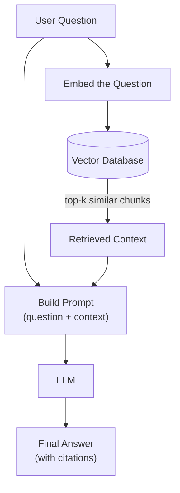

### 5.4 Complete RAG Pipeline

RAG has two distinct phases: an **offline indexing phase** (done once per
document, or whenever documents change) and an **online query phase** (done
on every user question).

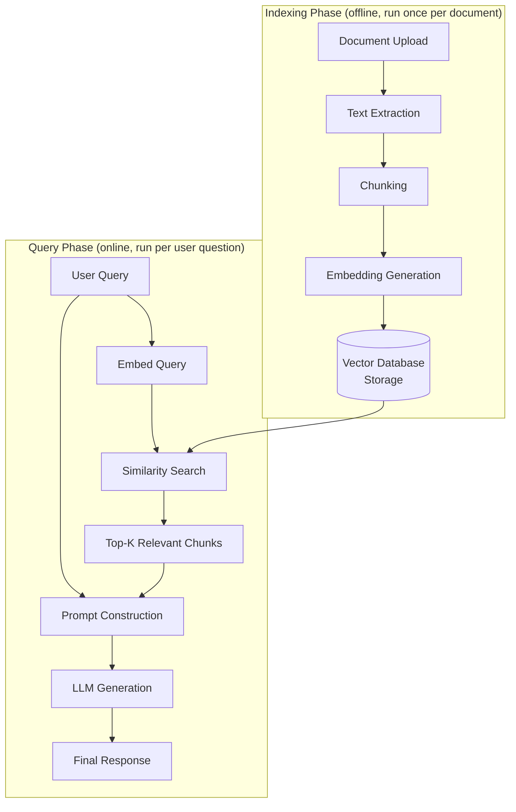

### 5.5 A Minimal RAG Implementation

```python
from openai import OpenAI
import chromadb

client = OpenAI()
chroma_client = chromadb.PersistentClient(path="./chroma_data")
collection = chroma_client.get_or_create_collection("docs")

def embed(text: str) -> list[float]:
    response = client.embeddings.create(model="text-embedding-3-small", input=text)
    return response.data[0].embedding

def index_document(doc_id: str, text: str):
    collection.upsert(ids=[doc_id], embeddings=[embed(text)], documents=[text])

def rag_answer(question: str, top_k: int = 3) -> str:
    query_vector = embed(question)
    results = collection.query(query_embeddings=[query_vector], n_results=top_k)
    context = "\n\n".join(results["documents"][0])

    completion = client.chat.completions.create(
        model="gpt-4o-mini",
        messages=[
            {"role": "system", "content": "Answer using only the provided context."},
            {"role": "user", "content": f"Context:\n{context}\n\nQuestion: {question}"},
        ],
    )
    return completion.choices[0].message.content

# Index some knowledge
index_document("doc1", "Our refund window is 30 days from the delivery date.")

# Ask a question
print(rag_answer("How long do I have to return an item?"))
```

### 5.6 RAG Best Practices at a Glance

- Keep chunks focused on a single idea (see Section 6).
- Always return **citations** (source filename, chunk ID) alongside
  generated answers so users can verify claims.
- Set the system prompt to explicitly instruct the model to say "I don't
  know" when the retrieved context doesn't answer the question, rather
  than guessing.
- Monitor retrieval quality separately from generation quality - a wrong
  answer might mean retrieval failed (wrong chunks retrieved), not that
  the LLM reasoned incorrectly.

## 6. Chunking

Chunking is the process of splitting long documents into smaller pieces
before embedding them. Embedding models perform best on focused, coherent
passages - embedding an entire 50-page PDF as one vector would blur
together too many unrelated ideas, and would likely exceed the model's
input size limit.

### 6.1 Fixed-Size Chunking

Splits text into chunks of a fixed number of characters or tokens,
regardless of sentence or paragraph boundaries.

```python
def fixed_size_chunk(text: str, size: int = 500, overlap: int = 50):
    chunks = []
    start = 0
    while start < len(text):
        chunks.append(text[start:start + size])
        start += size - overlap
    return chunks
```

**Pros:** simple, predictable, fast.
**Cons:** can cut sentences or ideas in half mid-thought, hurting retrieval
quality.

### 6.2 Recursive Chunking

Tries to split on the most "natural" boundary first (paragraph breaks),
and only falls back to smaller boundaries (sentences, then words, then
characters) if a chunk is still too large. This is the strategy used by
LangChain's `RecursiveCharacterTextSplitter` and is the most commonly used
approach in production RAG systems.

```python
from langchain_text_splitters import RecursiveCharacterTextSplitter

splitter = RecursiveCharacterTextSplitter(
    chunk_size=800,
    chunk_overlap=120,
    separators=["\n\n", "\n", ". ", " ", ""],
)
chunks = splitter.split_text(long_document_text)
```

**Pros:** respects natural language structure far better than fixed-size
chunking; still simple and fast.
**Cons:** chunk sizes vary; still boundary-based rather than meaning-based.

### 6.3 Semantic Chunking

Splits text based on **meaning shifts** rather than character counts - for
example, by embedding individual sentences and creating a new chunk
whenever consecutive sentences' embeddings diverge significantly.

```python
# Conceptual example (simplified)
def semantic_chunk(sentences: list[str], embed_fn, threshold: float = 0.75):
    chunks, current_chunk = [], [sentences[0]]
    prev_vector = embed_fn(sentences[0])

    for sentence in sentences[1:]:
        vector = embed_fn(sentence)
        similarity = cosine_similarity(prev_vector, vector)
        if similarity < threshold:
            chunks.append(" ".join(current_chunk))
            current_chunk = []
        current_chunk.append(sentence)
        prev_vector = vector

    chunks.append(" ".join(current_chunk))
    return chunks
```

**Pros:** produces chunks that are topically coherent, often improving
retrieval precision.
**Cons:** more expensive (requires embedding at the sentence level first);
more complex to implement and tune.

### 6.4 Sliding Window

A variant of fixed-size chunking where consecutive chunks **overlap** by a
set amount, so that ideas spanning a chunk boundary still appear fully in
at least one chunk.

```
Chunk 1: [----------------------]
Chunk 2:           [----------------------]
Chunk 3:                     [----------------------]
```

**Pros:** reduces the risk of losing context at chunk boundaries.
**Cons:** increases storage and embedding cost due to duplicated content.

### 6.5 Comparison

| Strategy | Respects meaning? | Cost | Complexity | Best for |
|---|---|---|---|---|
| Fixed-size | ❌ No | ✅ Very low | ✅ Very simple | Quick prototypes, uniform data |
| Recursive | ⚠️ Partially (structural) | ✅ Low | ✅ Simple | Most production RAG systems (default choice) |
| Semantic | ✅ Yes | ⚠️ Higher | ⚠️ Higher | High-precision retrieval, long-form content |
| Sliding Window | ⚠️ Partially | ⚠️ Higher (duplication) | ✅ Simple | Reducing boundary information loss |

> **Practical recommendation:** start with **recursive chunking**, a chunk
> size around 500-1000 characters (or ~150-300 tokens), and an overlap of
> 10-20% of the chunk size. Only move to semantic chunking if you've
> measured a retrieval quality problem that simpler chunking can't fix.

## 7. Metadata

Vectors alone only capture semantic meaning - but real applications almost
always need to combine similarity search with structured constraints.
**Metadata** is the structured data attached to each vector (filename,
author, date, category, permissions, etc.) that enables this.

### 7.1 Metadata Filtering

Metadata filtering narrows a similarity search to only vectors whose
metadata matches given criteria - combining the best of both traditional
databases (exact filters) and vector databases (semantic ranking).

```python
# Chroma example: only search chunks from PDF files uploaded in 2026
results = collection.query(
    query_embeddings=[query_vector],
    n_results=5,
    where={"file_type": "pdf"},
)
```

### 7.2 Tags

Tags are free-form or curated labels attached to a vector's metadata,
useful for many-to-many categorization (a document can have multiple tags).

```python
metadata = {
    "tags": ["billing", "refunds", "policy"],
}
```

### 7.3 Categories

Unlike tags, categories are typically a single, mutually-exclusive
classification - useful for narrowing a search to one specific domain.

```python
metadata = {"category": "legal"}

results = collection.query(
    query_embeddings=[query_vector],
    where={"category": "legal"},
)
```

### 7.4 Date Filtering

Storing timestamps in metadata lets you restrict search results to a time
window - critical for use cases like news search or compliance document
retrieval, where recency or a specific reporting period matters.

```python
# Qdrant example: only chunks from documents published after Jan 1, 2026
from qdrant_client.models import Filter, FieldCondition, Range

query_filter = Filter(
    must=[
        FieldCondition(key="published_at", range=Range(gte=1735689600))
    ]
)
```

### 7.5 User Filtering

In multi-tenant applications, metadata is essential for **data isolation**
- ensuring one user's search never returns another user's private
documents.

```python
results = collection.query(
    query_embeddings=[query_vector],
    where={"user_id": current_user.id},
)
```

> ⚠️ **Security note:** metadata-based user filtering must be enforced on
> the server side, never trusted from client input. Always inject the
> authenticated user's ID into the filter server-side - never accept a
> `user_id` filter value directly from the request body.

### 7.6 Practical Example: Combining Everything

```python
results = collection.query(
    query_embeddings=[embed("refund policy for damaged goods")],
    n_results=5,
    where={
        "$and": [
            {"category": "policy"},
            {"user_id": current_user.id},
            {"file_type": "pdf"},
        ]
    },
)
```

This single query performs **semantic search** ("refund policy for damaged
goods") narrowed by **three metadata filters** simultaneously - this
combination of vector similarity + structured filters is often called
**hybrid search** at the query level (distinct from hybrid *retrieval*,
which combines vector search with keyword/BM25 scoring - covered in
Section 11).

## 8. Vector Indexing

### 8.1 How Indexing Works

Without an index, finding the nearest neighbors to a query vector requires
comparing it against **every single stored vector** - this is called
**exact search** (or "flat" search), and it's accurate but slow at scale.

A **vector index** is a data structure that organizes vectors so that
nearest-neighbor search can skip comparing against most of them, trading a
small amount of accuracy for a massive gain in speed. This is called
**Approximate Nearest Neighbor (ANN)** search.

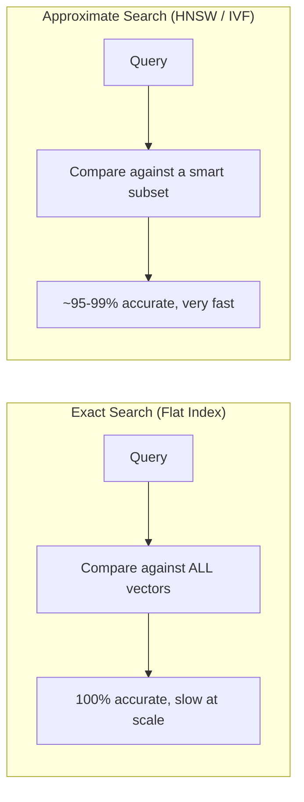

### 8.2 Flat Index (Exact Search)

Stores all vectors with no additional structure; search compares the query
against every vector directly.

| Pros | Cons |
|---|---|
| 100% accurate (exact nearest neighbors) | Slow - O(n) per query |
| No index build time or tuning | Doesn't scale past a few hundred thousand vectors for real-time use |
| Simple to reason about | Memory usage scales linearly |

**When to use:** small datasets (thousands of vectors), or when 100%
accuracy is a hard requirement (e.g. deduplication tasks).

### 8.3 HNSW (Hierarchical Navigable Small World)

HNSW builds a multi-layered graph where each vector is a node connected to
its approximate nearest neighbors. Searches start at a sparse top layer and
"navigate" down through denser layers, quickly zeroing in on the right
neighborhood without visiting most of the graph.

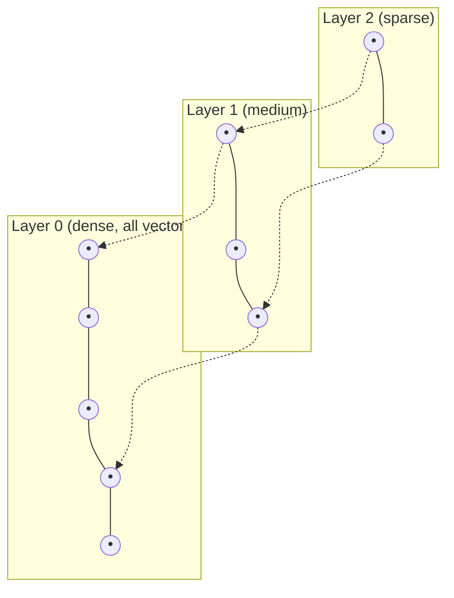

| Pros | Cons |
|---|---|
| Excellent speed/accuracy tradeoff | Higher memory usage than IVF/PQ |
| Good performance without heavy tuning | Index build time grows with dataset size |
| Supports incremental inserts well | Not ideal for extremely large (billion+) datasets without sharding |

**When to use:** the default choice for most applications - Chroma,
Qdrant, and Pinecone all use HNSW (or an HNSW variant) as their primary
index type.

### 8.4 IVF (Inverted File Index)

IVF partitions the vector space into clusters ("Voronoi cells") using a
clustering algorithm (like k-means). At query time, it identifies the
nearest cluster(s) and only searches vectors within them.

| Pros | Cons |
|---|---|
| Lower memory usage than HNSW | Requires a training/clustering step before use |
| Scales well to very large datasets | Accuracy depends heavily on cluster count tuning |
| Tunable speed/accuracy tradeoff via `nprobe` | Less effective on frequently-updated data (needs re-clustering) |

**When to use:** very large-scale deployments (hundreds of millions of
vectors) where memory efficiency matters more than the fastest possible
recall, often combined with PQ (below).

### 8.5 PQ (Product Quantization)

PQ is a **compression** technique, often layered on top of IVF (as
"IVF-PQ"). It splits each vector into sub-vectors and represents each
sub-vector with a compact code from a learned codebook, drastically
reducing memory usage at some cost to precision.

| Pros | Cons |
|---|---|
| Massive memory savings (10-30x compression) | Lower accuracy than uncompressed indexes |
| Enables billion-scale datasets on modest hardware | More complex to configure correctly |

**When to use:** extreme-scale deployments where memory cost is the primary
constraint, and a small accuracy tradeoff is acceptable.

### 8.6 Approximate Nearest Neighbor (ANN) vs Exact Search

| | Exact Search (Flat) | ANN (HNSW / IVF / PQ) |
|---|---|---|
| Accuracy | 100% | ~95-99.9% (tunable) |
| Speed at scale | Slow (linear) | Fast (sub-linear) |
| Memory | Highest | Lower (especially with PQ) |
| Best dataset size | < 1 million vectors | 1 million to billions of vectors |
| Used by default in | Small local prototypes | Chroma, Pinecone, Qdrant (production defaults) |

> **Practical takeaway:** you rarely choose an index type from scratch -
> Chroma, Pinecone, and Qdrant all default to HNSW, which is the right
> choice for the vast majority of applications. You'll only reach for IVF/PQ
> tuning once you're operating at tens-of-millions-plus vectors and have
> measured a real memory or latency problem.

## 9. Chroma

### 9.1 Architecture

Chroma is an **embedded, open-source vector database**. It runs inside
your application process (similar to how SQLite runs inside an app) and
persists data to a local folder on disk, or can run as a standalone client-
server deployment for shared access.

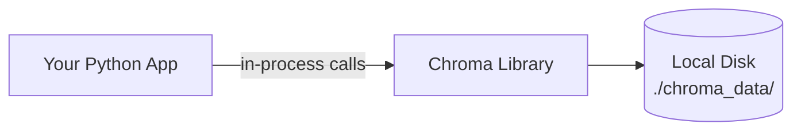

### 9.2 Advantages

- **Zero infrastructure** - no server, account, or API key needed to get
  started.
- **Free and open-source** with a permissive license.
- **Fast local iteration** - ideal for development and prototyping.
- Simple Python-first API.
- Can also run as a standalone server (`chromadb.HttpClient`) for shared
  access across multiple processes/machines.

### 9.3 Disadvantages

- Not designed for massive, distributed, multi-region scale out of the box.
- Local persistence mode is single-machine - no built-in replication or
  automatic failover.
- Smaller ecosystem of managed hosting options compared to Pinecone.
- Production-grade access control and multi-tenancy require more manual
  setup than a fully managed cloud service.

### 9.4 Installation

```bash
pip install chromadb
```

### 9.5 Configuration

```python
import chromadb
from chromadb.config import Settings

# Local, persistent, embedded mode (most common for small/medium apps)
client = chromadb.PersistentClient(
    path="./chroma_data",
    settings=Settings(anonymized_telemetry=False),
)

# OR: connect to a standalone Chroma server
# client = chromadb.HttpClient(host="localhost", port=8000)

collection = client.get_or_create_collection(
    name="documents",
    metadata={"hnsw:space": "cosine"},  # cosine | l2 | ip
)
```

### 9.6 Python Examples

```python
# Insert (upsert) vectors
collection.upsert(
    ids=["chunk_1", "chunk_2"],
    embeddings=[[0.1, 0.2, 0.3], [0.4, 0.1, 0.9]],
    documents=["Refunds are processed within 5 business days.",
               "Shipping takes 2-4 weeks internationally."],
    metadatas=[{"category": "billing"}, {"category": "shipping"}],
)

# Query
results = collection.query(
    query_embeddings=[[0.12, 0.19, 0.28]],
    n_results=2,
    where={"category": "billing"},
)

# Delete
collection.delete(where={"category": "shipping"})

# Count
print(collection.count())
```

### 9.7 When to Use Chroma

| Good fit | Poor fit |
|---|---|
| Local development and prototyping | Multi-region, globally distributed production workloads |
| Small-to-medium production apps (single server) | Billions of vectors requiring heavy sharding |
| Teams wanting zero cloud dependency | Teams needing a fully managed SLA-backed service out of the box |
| Learning and demos (like this project) | Extremely high write-throughput multi-tenant SaaS at scale |

### 9.8 Production Recommendations

- Run Chroma as a standalone server (`chromadb.HttpClient`) rather than
  embedded mode if multiple app instances need to share one collection.
- Mount the persistence directory on durable, backed-up storage (not an
  ephemeral container filesystem).
- Monitor disk usage - Chroma's local index grows with your vector count.
- For serious horizontal scaling needs, evaluate Pinecone or Qdrant Cloud
  instead - Chroma is intentionally optimized for simplicity, not
  distributed scale.

## 10. Pinecone

### 10.1 Architecture

Pinecone is a **fully-managed, cloud-native vector database**. You never
run Pinecone's server code yourself - you create an index through their
API or dashboard, and Pinecone handles storage, indexing, replication, and
scaling behind the scenes.

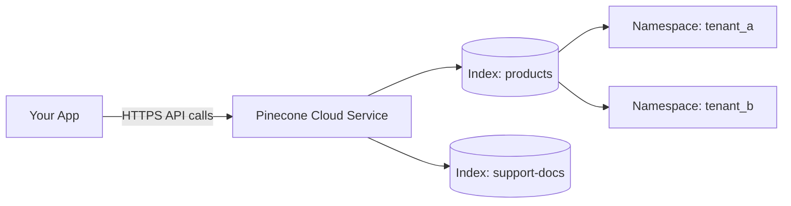

### 10.2 Advantages

- Fully managed - no servers to patch, scale, or monitor yourself.
- Built for production scale from day one (millions to billions of
  vectors).
- Serverless pricing model (pay for what you use).
- Strong metadata filtering support.
- Built-in **namespaces** for clean multi-tenant data isolation.

### 10.3 Disadvantages

- Requires an account, API key, and internet connectivity - no fully
  offline/local mode.
- Costs scale with usage; can become expensive at very high query volume.
- Less control over low-level index tuning compared to self-hosted
  options.
- Vendor lock-in considerations for teams wanting full infrastructure
  ownership.

### 10.4 Cloud Deployment

Pinecone indexes are created with a **cloud provider** and **region**,
determining where your data physically lives:

```python
from pinecone import Pinecone, ServerlessSpec

pc = Pinecone(api_key="YOUR_API_KEY")

pc.create_index(
    name="ai-search-engine",
    dimension=1536,
    metric="cosine",
    spec=ServerlessSpec(cloud="aws", region="us-east-1"),
)
```

### 10.5 Indexes

An **index** is Pinecone's top-level container for vectors of a fixed
dimension and distance metric - roughly analogous to a table in a SQL
database, or a collection in Chroma.

```python
index = pc.Index("ai-search-engine")
```

### 10.6 Namespaces

**Namespaces** partition a single index into isolated sub-groups - ideal
for multi-tenant SaaS applications where each customer's vectors should
never mix with another's, without needing a separate (billed) index per
tenant.

```python
# Upsert into a specific tenant's namespace
index.upsert(
    vectors=[{"id": "chunk_1", "values": [0.1, 0.2, 0.3], "metadata": {"text": "..."}}],
    namespace="tenant_a",
)

# Query only within that tenant's namespace
index.query(vector=[0.1, 0.2, 0.3], top_k=5, namespace="tenant_a")
```

### 10.7 Metadata Filtering

```python
index.query(
    vector=query_vector,
    top_k=5,
    filter={"category": {"$eq": "billing"}, "year": {"$gte": 2025}},
    include_metadata=True,
)
```

### 10.8 Pricing Overview

| Tier | Model | Good for |
|---|---|---|
| **Starter (free)** | Limited storage/usage, shared infrastructure | Learning, prototypes, small demos |
| **Standard** | Pay-as-you-go serverless pricing (reads, writes, storage) | Production apps with variable traffic |
| **Enterprise** | Custom pricing, SLAs, dedicated support | Large-scale, mission-critical deployments |

> Pricing changes over time - always check
> [pinecone.io/pricing](https://www.pinecone.io/pricing/) for current
> numbers before committing to a plan.

### 10.9 Python Examples

```python
from pinecone import Pinecone

pc = Pinecone(api_key="YOUR_API_KEY")
index = pc.Index("ai-search-engine")

# Upsert
index.upsert(vectors=[
    {"id": "doc1-chunk0", "values": embedding, "metadata": {"text": chunk_text, "source": "policy.pdf"}}
])

# Query
response = index.query(vector=query_embedding, top_k=5, include_metadata=True)
for match in response["matches"]:
    print(match["score"], match["metadata"]["text"])

# Delete
index.delete(ids=["doc1-chunk0"])

# Stats
print(index.describe_index_stats())
```

### 10.10 Production Recommendations

- Use **namespaces** for tenant isolation instead of separate indexes when
  tenants share the same embedding model/dimension.
- Batch upserts (Pinecone recommends batches of ~100 vectors) rather than
  one-at-a-time inserts.
- Set a **usage budget alert** in the Pinecone dashboard to avoid
  unexpected costs.
- Choose a region close to your application servers to minimize latency.
- Use metadata filters to keep queries efficient - don't rely purely on
  application-side post-filtering.

## 11. Qdrant

### 11.1 Architecture

Qdrant is an **open-source vector database** written in Rust, deployable
either self-hosted (via Docker/binary) or as a managed cloud service
(Qdrant Cloud). It's built around **collections** of **points**, each
point holding a vector and a JSON **payload** (metadata).

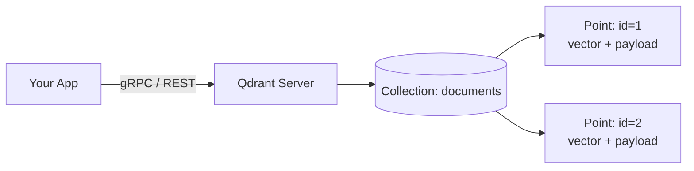

### 11.2 Advantages

- Open-source and self-hostable - full control over infrastructure.
- Excellent, first-class **payload filtering** (Qdrant's term for
  metadata filtering), with rich filter operators.
- Native support for **hybrid search** (combining dense vector search with
  sparse/keyword-style vectors in a single query).
- High-performance Rust implementation.
- Available both self-hosted and as a managed cloud offering - flexible
  deployment model.

### 11.3 Disadvantages

- Self-hosting requires you to manage infrastructure (unless using Qdrant
  Cloud).
- Smaller ecosystem/community than some competitors, though growing
  quickly.
- More configuration knobs than Chroma, meaning a slightly steeper
  learning curve for beginners.

### 11.4 Collections

A **collection** is Qdrant's container for points of a given vector
dimension and distance metric - equivalent to a Chroma "collection" or
Pinecone "index."

```python
from qdrant_client import QdrantClient
from qdrant_client.models import VectorParams, Distance

client = QdrantClient(url="http://localhost:6333")

client.create_collection(
    collection_name="documents",
    vectors_config=VectorParams(size=1536, distance=Distance.COSINE),
)
```

### 11.5 Payloads

A **payload** is the JSON metadata attached to each point - Qdrant's
equivalent of Chroma's `metadatas` or Pinecone's `metadata`.

```python
from qdrant_client.models import PointStruct

client.upsert(
    collection_name="documents",
    points=[
        PointStruct(
            id=1,
            vector=[0.1, 0.2, 0.3],
            payload={"text": "Refunds take 5 business days.", "category": "billing"},
        )
    ],
)
```

### 11.6 Filtering

```python
from qdrant_client.models import Filter, FieldCondition, MatchValue

results = client.search(
    collection_name="documents",
    query_vector=[0.1, 0.2, 0.3],
    query_filter=Filter(
        must=[FieldCondition(key="category", match=MatchValue(value="billing"))]
    ),
    limit=5,
)
```

### 11.7 Hybrid Search

Qdrant natively supports combining **dense vectors** (semantic embeddings)
with **sparse vectors** (keyword/BM25-style representations) in a single
query, letting you get the best of both semantic understanding and exact
keyword precision.

```python
from qdrant_client.models import NamedVector

# Conceptual example - Qdrant supports multiple named vectors per point,
# enabling a dense + sparse hybrid setup
results = client.search(
    collection_name="documents",
    query_vector=NamedVector(name="dense", vector=query_embedding),
    limit=5,
)
```

### 11.8 Docker Deployment

```bash
docker run -p 6333:6333 -p 6334:6334 \
  -v $(pwd)/qdrant_data:/qdrant/storage \
  qdrant/qdrant
```

**Expected output:**

```
Qdrant HTTP listening on 6333
Qdrant gRPC listening on 6334
```

### 11.9 Python Examples

```python
from qdrant_client import QdrantClient
from qdrant_client.models import VectorParams, Distance, PointStruct

client = QdrantClient(url="http://localhost:6333")

# Create collection
client.create_collection(
    collection_name="documents",
    vectors_config=VectorParams(size=1536, distance=Distance.COSINE),
)

# Upsert
client.upsert(
    collection_name="documents",
    points=[PointStruct(id=1, vector=embedding, payload={"text": chunk_text})],
)

# Search
results = client.search(collection_name="documents", query_vector=query_embedding, limit=5)
for point in results:
    print(point.score, point.payload["text"])

# Delete
client.delete(collection_name="documents", points_selector=[1])
```

### 11.10 Production Recommendations

- Use **Qdrant Cloud** if you want managed infrastructure without giving
  up Qdrant's filtering/hybrid-search capabilities.
- Enable **API key authentication** on any self-hosted instance exposed
  beyond localhost.
- Use **payload indexes** (`create_payload_index`) on frequently-filtered
  fields to keep filtered search fast at scale.
- Mount persistent storage volumes when running via Docker - otherwise
  data is lost when the container is removed.
- For hybrid search, evaluate whether sparse+dense truly improves your
  results over dense-only search before adding the complexity.

## 12. Compare Chroma vs Pinecone vs Qdrant

| Criteria | Chroma | Pinecone | Qdrant |
|---|---|---|---|
| **Ease of Use** | ⭐⭐⭐⭐⭐ Simplest - zero setup | ⭐⭐⭐⭐ Simple API, but requires account setup | ⭐⭐⭐ Slightly more configuration |
| **Performance (small-medium scale)** | ⭐⭐⭐⭐ Very good locally | ⭐⭐⭐⭐⭐ Excellent, optimized cloud infra | ⭐⭐⭐⭐⭐ Excellent, Rust-based |
| **Scalability (large scale)** | ⭐⭐ Best for single-machine scale | ⭐⭐⭐⭐⭐ Built for massive scale | ⭐⭐⭐⭐ Scales well, more manual tuning |
| **Cloud Support** | ⚠️ Limited managed hosting options | ✅ Fully managed, cloud-native | ✅ Qdrant Cloud available |
| **Self-Hosting** | ✅ Default mode | ❌ Not available | ✅ First-class support (Docker) |
| **Metadata Filtering** | ✅ Good | ✅ Excellent | ✅ Excellent (richest operators) |
| **Hybrid Search** | ⚠️ Limited/manual | ⚠️ Supported via metadata + separate sparse index | ✅ Native dense+sparse support |
| **Cost (small projects)** | ✅ Free (self-hosted) | ⚠️ Free tier, then usage-based | ✅ Free (self-hosted) or Cloud tier |
| **Cost (large scale)** | Depends on your own infra costs | ⚠️ Can become expensive at high volume | Depends on your own infra costs (or Cloud tier) |
| **Best Use Cases** | Local dev, prototypes, small production apps | Production SaaS needing zero ops overhead | Teams wanting control + strong filtering/hybrid search |
| **Enterprise Readiness** | ⚠️ Requires more DIY hardening | ✅ SLAs, enterprise support tiers | ✅ Enterprise support via Qdrant Cloud |
| **Language** | Python (core) | N/A (managed service, any language via API) | Rust (core), clients in many languages |
| **License** | Apache 2.0 (open source) | Proprietary (managed service) | Apache 2.0 (open source) |

### 12.1 Decision Guide

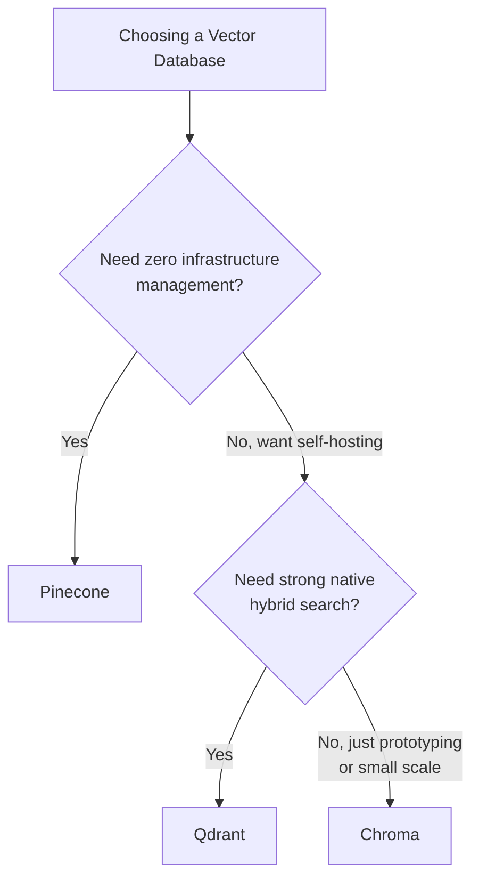

### 12.2 Summary Recommendation

- **Choose Chroma** for learning, prototyping, and small-to-medium
  production apps where you control the server and want zero external
  dependencies.
- **Choose Pinecone** for production SaaS products where you want a fully
  managed, "just works" experience and are comfortable with usage-based
  cloud pricing.
- **Choose Qdrant** when you want strong filtering and native hybrid
  search, with the flexibility to self-host or use a managed cloud tier.

## 13. LangChain Integration

LangChain provides a unified `VectorStore` interface, so you can swap
between Chroma, Pinecone, and Qdrant with minimal code changes - the
retrieval and RAG logic built on top stays identical.

### 13.1 Chroma with LangChain

```bash
pip install langchain-chroma langchain-openai
```

```python
from langchain_openai import OpenAIEmbeddings
from langchain_chroma import Chroma

embeddings = OpenAIEmbeddings(model="text-embedding-3-small")

vectorstore = Chroma(
    collection_name="documents",
    embedding_function=embeddings,
    persist_directory="./chroma_data",
)

vectorstore.add_texts(
    texts=["Refunds take 5 business days.", "Shipping takes 2-4 weeks."],
    metadatas=[{"category": "billing"}, {"category": "shipping"}],
)

results = vectorstore.similarity_search("How long until I get my refund?", k=2)
```

### 13.2 Pinecone with LangChain

```bash
pip install langchain-pinecone langchain-openai
```

```python
from langchain_openai import OpenAIEmbeddings
from langchain_pinecone import PineconeVectorStore

embeddings = OpenAIEmbeddings(model="text-embedding-3-small")

vectorstore = PineconeVectorStore(
    index_name="ai-search-engine",
    embedding=embeddings,
    namespace="tenant_a",
)

vectorstore.add_texts(["Refunds take 5 business days."])
results = vectorstore.similarity_search("refund timing", k=3)
```

### 13.3 Qdrant with LangChain

```bash
pip install langchain-qdrant langchain-openai
```

```python
from langchain_openai import OpenAIEmbeddings
from langchain_qdrant import QdrantVectorStore
from qdrant_client import QdrantClient

client = QdrantClient(url="http://localhost:6333")
embeddings = OpenAIEmbeddings(model="text-embedding-3-small")

vectorstore = QdrantVectorStore(
    client=client,
    collection_name="documents",
    embedding=embeddings,
)

vectorstore.add_texts(["Refunds take 5 business days."])
results = vectorstore.similarity_search("refund timing", k=3)
```

### 13.4 Building a Retriever + RAG Chain

Once wrapped as a LangChain `VectorStore`, any of the three can power a
retriever and a full RAG chain with identical code:

```python
from langchain_openai import ChatOpenAI
from langchain_core.prompts import ChatPromptTemplate
from langchain_core.output_parsers import StrOutputParser
from langchain_core.runnables import RunnablePassthrough

retriever = vectorstore.as_retriever(search_kwargs={"k": 4})
llm = ChatOpenAI(model="gpt-4o-mini", temperature=0.2)

prompt = ChatPromptTemplate.from_template(
    "Answer using only this context:\n{context}\n\nQuestion: {question}"
)

def format_docs(docs):
    return "\n\n".join(doc.page_content for doc in docs)

rag_chain = (
    {"context": retriever | format_docs, "question": RunnablePassthrough()}
    | prompt
    | llm
    | StrOutputParser()
)

answer = rag_chain.invoke("How long until I get my refund?")
print(answer)
```

> **Key takeaway:** LangChain's abstraction means switching vector
> databases is usually a one-line change (swapping which `VectorStore`
> class you instantiate) - the retriever, prompt, and chain logic don't
> need to change at all.

## 14. FastAPI Integration

FastAPI is a natural fit for building the backend of a vector-search or RAG
application: it's async-friendly, has built-in request validation via
Pydantic, and generates interactive API docs automatically.

### 14.1 Architecture

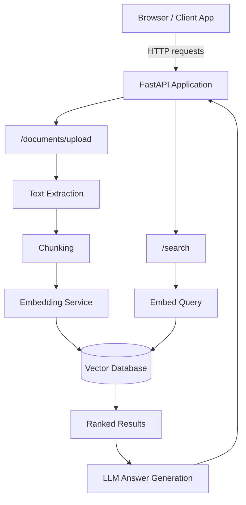

### 14.2 Minimal FastAPI + Vector DB Example

```python
from fastapi import FastAPI
from pydantic import BaseModel
import chromadb
from openai import OpenAI

app = FastAPI(title="Semantic Search API")
client = OpenAI()
chroma = chromadb.PersistentClient(path="./chroma_data")
collection = chroma.get_or_create_collection("documents")

class SearchRequest(BaseModel):
    query: str
    top_k: int = 5

class SearchResult(BaseModel):
    text: str
    score: float

@app.post("/search", response_model=list[SearchResult])
def search(request: SearchRequest):
    query_vector = client.embeddings.create(
        model="text-embedding-3-small", input=request.query
    ).data[0].embedding

    results = collection.query(query_embeddings=[query_vector], n_results=request.top_k)

    return [
        SearchResult(text=doc, score=round(1 - dist, 4))
        for doc, dist in zip(results["documents"][0], results["distances"][0])
    ]
```

### 14.3 Running It

```bash
uvicorn main:app --reload
```

**Expected output:**

```
INFO:     Uvicorn running on http://127.0.0.1:8000
INFO:     Application startup complete.
```

Visit `http://127.0.0.1:8000/docs` for automatically generated interactive
API documentation (Swagger UI), where you can test the `/search` endpoint
directly in your browser.

### 14.4 Design Recommendations

- Keep the vector store adapter behind an interface (as in Section 12's
  comparison) so you can switch providers via configuration, not code
  changes.
- Use Pydantic models for all request/response bodies - this gives you
  automatic validation and OpenAPI documentation for free.
- Use FastAPI's `StreamingResponse` for token-by-token LLM answer
  streaming, improving perceived latency for end users.
- Keep embedding calls and vector DB calls in dedicated modules (not
  inline in route handlers) so they're independently testable.

## 15. OpenAI Responses API Integration

The OpenAI API is commonly used for two distinct steps in a RAG pipeline:
generating embeddings for storage/retrieval, and generating the final
natural-language answer once relevant context has been retrieved.

### 15.1 Embedding Generation

```python
from openai import OpenAI

client = OpenAI()

def embed_texts(texts: list[str]) -> list[list[float]]:
    response = client.embeddings.create(
        model="text-embedding-3-small",
        input=texts,
    )
    return [item.embedding for item in response.data]

vectors = embed_texts(["Refunds take 5 business days.", "Shipping takes 2-4 weeks."])
print(len(vectors), len(vectors[0]))  # 2 1536
```

> Batch multiple texts into a single `embeddings.create()` call whenever
> possible - it's significantly more efficient than one request per text
> (see Section 18 on performance optimization).

### 15.2 Vector Storage

Once generated, embeddings are stored in your chosen vector database
alongside the original text and metadata (see Sections 9-11 for
provider-specific storage examples):

```python
collection.upsert(
    ids=["chunk_1", "chunk_2"],
    embeddings=vectors,
    documents=["Refunds take 5 business days.", "Shipping takes 2-4 weeks."],
)
```

### 15.3 Retrieval

```python
query_vector = embed_texts(["How long until my refund arrives?"])[0]

results = collection.query(query_embeddings=[query_vector], n_results=3)
retrieved_chunks = results["documents"][0]
```

### 15.4 Final Response Generation

```python
def generate_answer(question: str, context_chunks: list[str]) -> str:
    context = "\n\n".join(f"[Source {i+1}] {c}" for i, c in enumerate(context_chunks))

    completion = client.chat.completions.create(
        model="gpt-4o-mini",
        messages=[
            {
                "role": "system",
                "content": (
                    "Answer using ONLY the provided sources. Cite sources "
                    "using [Source N] notation. If the sources don't answer "
                    "the question, say so."
                ),
            },
            {"role": "user", "content": f"Sources:\n{context}\n\nQuestion: {question}"},
        ],
        temperature=0.2,
    )
    return completion.choices[0].message.content

answer = generate_answer("How long until my refund arrives?", retrieved_chunks)
print(answer)
# "Refunds are processed within 5 business days [Source 1]."
```

### 15.5 Streaming Responses

```python
def generate_answer_stream(question: str, context_chunks: list[str]):
    context = "\n\n".join(context_chunks)
    stream = client.chat.completions.create(
        model="gpt-4o-mini",
        messages=[
            {"role": "system", "content": "Answer using only the provided context."},
            {"role": "user", "content": f"Context:\n{context}\n\nQuestion: {question}"},
        ],
        stream=True,
    )
    for chunk in stream:
        delta = chunk.choices[0].delta.content
        if delta:
            yield delta

for token in generate_answer_stream("How long until my refund arrives?", retrieved_chunks):
    print(token, end="", flush=True)
```

### 15.6 End-to-End Flow Recap

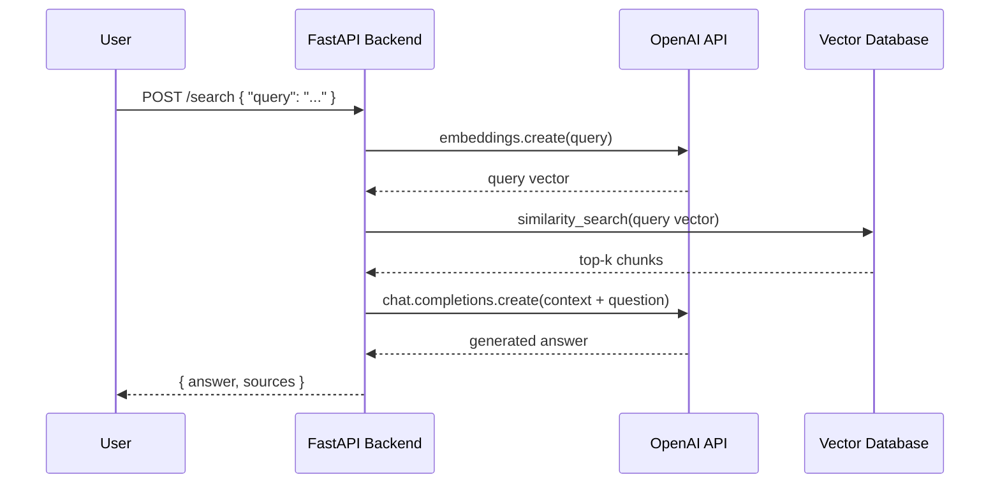

## 16. Production Architecture

A complete, enterprise-grade RAG system involves more moving parts than a
prototype: authentication, caching, observability, and a clear separation
between the indexing and query paths.

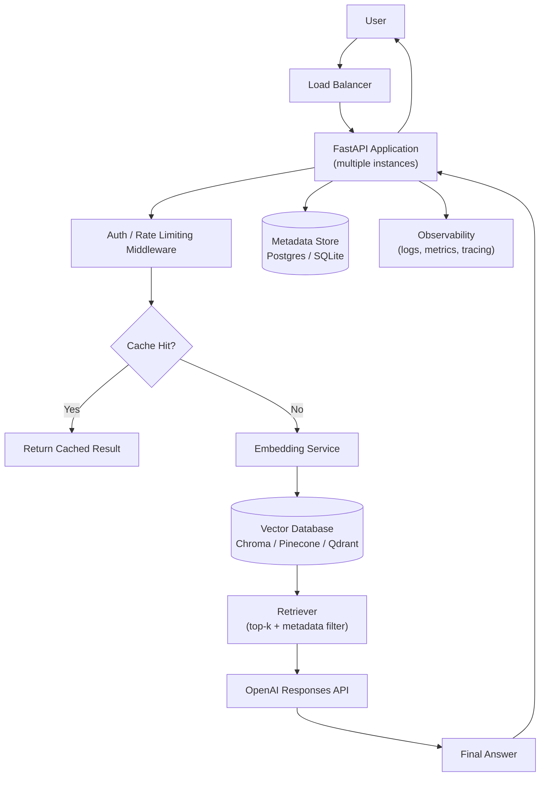

### 16.1 Layer Responsibilities

| Layer | Responsibility |
|---|---|
| **Load Balancer** | Distributes traffic across app instances; handles TLS termination |
| **FastAPI Application** | Request validation, orchestration, business logic |
| **Auth / Rate Limiting** | Verifies identity, enforces per-user/per-key limits |
| **Cache** | Avoids redundant embedding/LLM calls for repeated queries |
| **Embedding Service** | Wraps the embedding model provider (OpenAI or self-hosted) |
| **Vector Database** | Stores and searches embeddings |
| **Retriever** | Applies top-k selection and metadata filters |
| **LLM (Responses API)** | Generates the final grounded answer |
| **Metadata Store** | Structured data: documents, users, search history, permissions |
| **Observability** | Logs, metrics, and tracing for debugging and performance monitoring |

### 16.2 Separating Indexing and Query Paths

In production, document indexing (a write-heavy, potentially slow
operation) should typically run as a **background job**, not inline in the
HTTP request/response cycle:

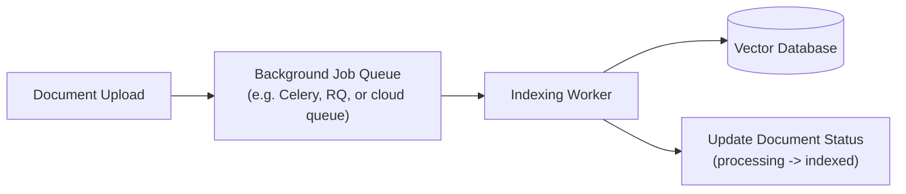

This keeps the upload endpoint fast and responsive, and lets you retry
failed indexing jobs independently of the user's request lifecycle.

## 17. Security Best Practices

### 17.1 API Keys

- Never hardcode API keys in source code - load them from environment
  variables or a secrets manager.
- Use **separate keys** per environment (development, staging,
  production) so a leaked dev key doesn't compromise production.
- Rotate keys periodically and immediately after any suspected exposure.

```python
import os
from openai import OpenAI

client = OpenAI(api_key=os.environ["OPENAI_API_KEY"])  # never hardcode
```

### 17.2 Authentication

Every endpoint that accesses user-specific or private data must verify
**who** is making the request - typically via a bearer token, session
cookie, or API key tied to a specific account.

```python
from fastapi import Depends, HTTPException, Header

def get_current_user(authorization: str = Header(...)):
    token = authorization.replace("Bearer ", "")
    user = verify_token(token)  # your own token verification logic
    if not user:
        raise HTTPException(status_code=401, detail="Invalid or expired token")
    return user
```

### 17.3 Authorization

Authentication confirms *who* the user is; authorization confirms *what
they're allowed to do*. In a RAG system, this typically means restricting
search results to documents the requesting user is permitted to see.

```python
results = collection.query(
    query_embeddings=[query_vector],
    where={"owner_id": current_user.id},  # enforce ownership server-side
)
```

### 17.4 Encryption

- **In transit:** always use HTTPS/TLS for API traffic, including calls
  between your app and your vector database (most managed providers
  enforce this by default).
- **At rest:** enable disk encryption for self-hosted vector databases
  (most cloud disks support this natively); managed services like
  Pinecone and Qdrant Cloud typically encrypt data at rest by default.

### 17.5 Access Control

- Apply the principle of least privilege: API keys/service accounts
  should only have the permissions they actually need (e.g. a read-only
  key for a search-only microservice).
- Use network-level restrictions (VPC peering, IP allowlists, firewall
  rules) for self-hosted vector databases like Qdrant.

### 17.6 Rate Limiting

Rate limiting protects both your infrastructure costs (embedding/LLM
calls are billed per use) and your users' experience.

```python
from fastapi import FastAPI, Request, HTTPException
from collections import defaultdict
import time

app = FastAPI()
request_log = defaultdict(list)

@app.middleware("http")
async def rate_limit(request: Request, call_next):
    client_ip = request.client.host
    now = time.time()
    request_log[client_ip] = [t for t in request_log[client_ip] if now - t < 60]

    if len(request_log[client_ip]) >= 30:  # 30 requests per minute
        raise HTTPException(status_code=429, detail="Rate limit exceeded")

    request_log[client_ip].append(now)
    return await call_next(request)
```

> For production use, prefer a dedicated rate-limiting solution (e.g.
> Redis-backed, or an API gateway feature) over the in-memory example
> above, which doesn't work correctly across multiple app instances.

### 17.7 Secrets Management

| Environment | Recommended approach |
|---|---|
| Local development | `.env` file (excluded via `.gitignore`) |
| CI/CD pipelines | Encrypted pipeline secrets (GitHub Actions secrets, etc.) |
| Cloud production | Managed secrets service (AWS Secrets Manager, GCP Secret Manager, Azure Key Vault) |

> **Never commit `.env` files, API keys, or credentials to version
> control** - even in private repositories. Use `git-secrets` or similar
> pre-commit hooks to catch accidental commits.

## 18. Performance Optimization

### 18.1 Batch Embeddings

Sending texts one at a time to the embeddings API multiplies network
overhead. Always batch:

```python
# Slow: N network round trips
vectors = [embed_one(text) for text in texts]

# Fast: 1 network round trip
vectors = client.embeddings.create(model="text-embedding-3-small", input=texts).data
```

### 18.2 Caching

Cache both embeddings and LLM answers where appropriate:

| What to cache | Why |
|---|---|
| Query embeddings for repeated/common queries | Avoids redundant embedding API calls |
| Full search results for identical queries | Avoids redundant vector DB queries |
| LLM answers for identical (query + context) pairs | Avoids redundant, costly generation calls |

```python
import hashlib
import functools

@functools.lru_cache(maxsize=1000)
def cached_embed(text: str) -> tuple:
    return tuple(embed_texts([text])[0])
```

For multi-process deployments, use a shared cache (Redis) instead of an
in-process `lru_cache`.

### 18.3 Chunk Optimization

- Chunks that are **too small** lose surrounding context and increase the
  number of embedding calls and stored vectors.
- Chunks that are **too large** dilute the embedding's focus and can
  exceed model input limits.
- Benchmark retrieval quality at a few chunk sizes (e.g. 300, 500, 800,
  1200 characters) against a set of representative test queries before
  locking in a value.

### 18.4 Index Optimization

- Use the ANN index type your vector database defaults to (usually HNSW)
  unless you've measured a specific need to change it.
- Tune HNSW's `ef_search` / `ef_construction` parameters only after
  profiling - higher values improve recall at the cost of latency.
- Periodically remove stale/deleted vectors (some databases require
  explicit compaction) to keep index size and query latency in check.

### 18.5 Filtering

Apply metadata filters **before** or **during** the vector search
(pre-filtering) rather than fetching a large result set and filtering in
application code (post-filtering) - this avoids wasting compute on
results you'll discard anyway.

```python
# Good: pre-filter in the query itself
results = collection.query(query_embeddings=[qv], where={"category": "billing"}, n_results=5)

# Avoid: over-fetching then filtering in Python
results = collection.query(query_embeddings=[qv], n_results=500)
filtered = [r for r in results if r["category"] == "billing"][:5]
```

### 18.6 Hybrid Search

Combining vector similarity with keyword/BM25 scoring (hybrid search) can
improve precision for queries containing exact terms (product codes,
names, acronyms) that pure semantic search might under-rank. Qdrant
supports this natively (Section 11.7); with Chroma or Pinecone, you can
implement it by running both search types and merging/re-ranking results.

### 18.7 Latency Optimization

| Technique | Impact |
|---|---|
| Batch embedding calls | Reduces network round-trip overhead |
| Cache repeated queries | Eliminates redundant compute entirely |
| Use a smaller/faster embedding model where quality allows | Reduces embedding latency |
| Co-locate app servers and vector DB region | Reduces network latency |
| Stream LLM responses to the client | Improves perceived latency, not raw latency |
| Reduce `top_k` to only what the LLM actually needs | Reduces both retrieval and prompt-processing time |

## 19. Scaling

### 19.1 Horizontal Scaling

Running multiple instances of your FastAPI application behind a load
balancer lets you handle more concurrent requests. Since embeddings and
LLM calls are stateless, the application layer scales horizontally with
minimal friction - the harder scaling problem is usually the vector
database itself.

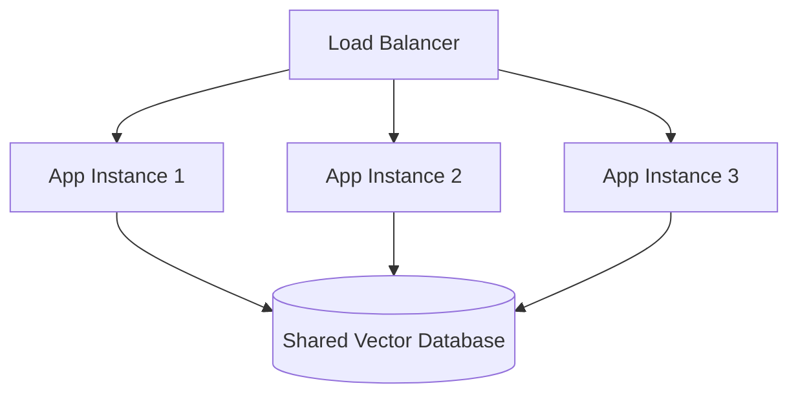

### 19.2 Replication

Replication keeps multiple copies of your vector data across nodes for
**availability** (surviving node failures) and **read throughput**
(distributing queries across replicas).

| Provider | Replication approach |
|---|---|
| Chroma | Not built-in for local mode; requires external replication of the persistence directory |
| Pinecone | Handled automatically by the managed service |
| Qdrant | Native replication support (`replication_factor` on collections) |

### 19.3 Sharding

Sharding splits a large dataset across multiple nodes, each holding a
subset of the vectors, so no single machine needs to hold the entire
index in memory.

| Provider | Sharding approach |
|---|---|
| Chroma | Manual (you'd partition collections yourself) |
| Pinecone | Automatic, transparent to the user (serverless indexes) |
| Qdrant | Native sharding support (`shard_number` on collections) |

### 19.4 Cloud Deployments

Cloud-managed vector databases (Pinecone, Qdrant Cloud) abstract away
replication and sharding entirely - you configure a target scale and the
provider handles the underlying distribution. Self-hosted deployments
(Chroma, self-hosted Qdrant) require you to design this yourself as usage
grows.

### 19.5 Load Balancing

For self-hosted vector databases behind multiple nodes, place a load
balancer (e.g. NGINX, a cloud load balancer, or a service mesh) in front
of the database's query endpoints, and ensure health checks correctly
detect unhealthy nodes.

### 19.6 High Availability

| Requirement | How to achieve it |
|---|---|
| No single point of failure | Multiple app instances + replicated vector DB nodes |
| Automatic failover | Load balancer health checks + managed service SLAs |
| Data durability | Regular backups of persistence directories / managed snapshots |
| Graceful degradation | Serve cached/fallback answers if the vector DB is temporarily unreachable |

> **Practical guidance:** most teams don't need to solve replication and
> sharding themselves - choosing a managed provider (Pinecone, Qdrant
> Cloud) for production is usually far more cost-effective than building
> and operating this infrastructure in-house, unless you have very
> specific data residency or cost requirements at extreme scale.

## 20. Deployment

### 20.1 Local

```bash
python -m venv venv
source venv/bin/activate      # Windows: venv\Scripts\activate
pip install -r requirements.txt
uvicorn main:app --reload
```

### 20.2 Docker

```dockerfile
FROM python:3.12-slim

WORKDIR /app
COPY requirements.txt .
RUN pip install --no-cache-dir -r requirements.txt

COPY . .

EXPOSE 8000
CMD ["uvicorn", "main:app", "--host", "0.0.0.0", "--port", "8000"]
```

```bash
docker build -t ai-search-engine .
docker run -p 8000:8000 --env-file .env ai-search-engine
```

### 20.3 Docker Compose

For local development with Qdrant running alongside your app:

```yaml
version: "3.9"
services:
  app:
    build: .
    ports:
      - "8000:8000"
    env_file: .env
    depends_on:
      - qdrant

  qdrant:
    image: qdrant/qdrant
    ports:
      - "6333:6333"
    volumes:
      - qdrant_data:/qdrant/storage

volumes:
  qdrant_data:
```

```bash
docker compose up --build
```

### 20.4 Railway

1. Push your repository to GitHub.
2. Create a new project at [railway.app](https://railway.app), selecting
   "Deploy from GitHub repo."
3. Set environment variables (from your `.env`) in Railway's dashboard
   under **Variables**.
4. Railway auto-detects the Python app; set the start command if needed:
   ```
   uvicorn main:app --host 0.0.0.0 --port $PORT
   ```

### 20.5 Render

1. Create a new **Web Service** at [render.com](https://render.com),
   connected to your GitHub repository.
2. Build command: `pip install -r requirements.txt`
3. Start command: `uvicorn main:app --host 0.0.0.0 --port $PORT`
4. Add environment variables under **Environment**.

### 20.6 Azure

Use **Azure App Service** for a straightforward managed deployment:

```bash
az webapp up --name ai-search-engine --runtime "PYTHON:3.12"
```

Set application settings (environment variables) via:

```bash
az webapp config appsettings set --name ai-search-engine \
  --resource-group my-resource-group \
  --settings OPENAI_API_KEY=sk-... VECTOR_DB_PROVIDER=qdrant
```

### 20.7 AWS

Common options, roughly in order of increasing operational complexity:

| Option | Good for |
|---|---|
| **AWS App Runner** | Simplest managed container deployment |
| **Elastic Beanstalk** | Managed PaaS with more configuration control |
| **ECS (Fargate)** | Container orchestration without managing servers |
| **EC2** | Full control, most operational overhead |

```bash
# Example: App Runner via AWS CLI (conceptual)
aws apprunner create-service \
  --service-name ai-search-engine \
  --source-configuration file://apprunner-config.json
```

### 20.8 Google Cloud

**Cloud Run** is typically the simplest option for a containerized FastAPI
app:

```bash
gcloud run deploy ai-search-engine \
  --source . \
  --platform managed \
  --region us-central1 \
  --allow-unauthenticated \
  --set-env-vars OPENAI_API_KEY=sk-...,VECTOR_DB_PROVIDER=qdrant
```

### 20.9 Deployment Comparison

| Platform | Setup effort | Good for |
|---|---|---|
| Local | ✅ Minimal | Development only |
| Docker | ⚠️ Low-moderate | Consistent environments, any host |
| Docker Compose | ⚠️ Low-moderate | Local multi-service dev (app + Qdrant) |
| Railway | ✅ Very low | Quick production deploys, small teams |
| Render | ✅ Very low | Quick production deploys, small teams |
| Azure App Service | ⚠️ Moderate | Enterprises already on Azure |
| AWS (App Runner/ECS) | ⚠️ Moderate-high | Enterprises already on AWS, fine-grained control |
| Google Cloud Run | ⚠️ Low-moderate | Serverless containers, pay-per-use |

## 21. Repository Structure

A clean, production-ready structure for an AI application built around a
vector database keeps most files in the root (easy to browse), separates
concerns into focused single-purpose modules, and isolates
frontend/tests/docs into their own folders.

```
ai-search-project/
├── main.py                      # FastAPI app & routes
├── config.py                    # Environment-based settings
├── logger.py                    # Shared logging setup
├── models.py                    # Pydantic schemas
├── database.py                  # SQLite/Postgres metadata persistence
├── document_processor.py        # Text extraction (PDF/TXT/MD/etc.)
├── chunking.py                  # Text splitting strategies
├── embeddings.py                # Embedding + LLM generation wrapper
├── search_engine.py             # RAG pipeline orchestration
├── vector_store_base.py         # Adapter interface
├── vector_store_chroma.py       # Chroma adapter
├── vector_store_pinecone.py     # Pinecone adapter
├── vector_store_qdrant.py       # Qdrant adapter
├── vector_store_factory.py      # Picks the active adapter
├── requirements.txt
├── .env.example
├── .gitignore
├── Dockerfile
├── docker-compose.yml
├── static/                      # CSS/JS for a simple frontend
│   ├── style.css
│   └── app.js
├── templates/                   # HTML templates (if using server-rendered UI)
│   └── index.html
├── tests/
│   ├── test_chunking.py
│   ├── test_document_processor.py
│   └── test_search_engine.py
└── docs/
    ├── architecture.md
    └── screenshots/
```

### 21.1 Why This Structure Works

| Principle | How it's applied |
|---|---|
| **Single responsibility** | Each file does one job (chunking, embedding, storage, etc.) |
| **Swappable providers** | Vector store adapters share one interface, selected via config |
| **Flat browsability** | Core logic stays in the root - no unnecessary nested folders |
| **Separation of concerns** | Frontend, tests, and docs live in their own folders |
| **Config over code** | Behavior (which vector DB, chunk size, etc.) is environment-driven |

### 21.2 Scaling the Structure for Larger Teams

As a project grows past a single-service app, consider evolving toward:

```
services/
├── api/              # FastAPI application (as above)
├── indexing-worker/  # Background job worker for document processing
└── shared/           # Shared models, config, and vector store adapters
```

This separates the request-handling API from the (often slower,
resource-intensive) indexing pipeline, letting each scale independently.

## 22. Common Mistakes

| # | Mistake | How to Avoid It |
|---|---|---|
| 1 | Embedding entire documents as a single vector | Chunk documents first (Section 6) so each vector represents a focused idea |
| 2 | Using inconsistent embedding models between indexing and querying | Always use the exact same model/version for both indexing and search |
| 3 | Mixing vectors from different embedding models in one collection | Keep one collection per embedding model/dimension; never mix |
| 4 | Not normalizing/considering distance metric mismatches | Confirm your distance metric (cosine, dot, Euclidean) matches how the embedding model was trained/intended to be used |
| 5 | Choosing chunk sizes without testing | Benchmark a few chunk sizes against real queries before finalizing |
| 6 | No overlap between chunks | Add 10-20% overlap so ideas spanning chunk boundaries aren't lost |
| 7 | Hardcoding API keys in source code | Load all secrets from environment variables or a secrets manager |
| 8 | Committing `.env` files to Git | Add `.env` to `.gitignore` from day one |
| 9 | Sending one embedding request per chunk instead of batching | Batch multiple texts into a single embeddings API call |
| 10 | Not handling embedding API rate limits/errors | Add retries with exponential backoff around embedding/LLM calls |
| 11 | Storing raw uploaded files indefinitely | Delete originals after extraction unless you have a specific reason to retain them |
| 12 | No metadata filtering for multi-tenant apps | Always scope queries by `user_id`/`tenant_id` server-side |
| 13 | Trusting client-supplied filters for access control | Enforce ownership/permission filters server-side, never from request body |
| 14 | Returning raw LLM output without citations | Always surface the source chunk/document alongside generated answers |
| 15 | Not instructing the LLM to say "I don't know" | Explicitly prompt the model to admit when context doesn't answer the question |
| 16 | Retrieving too few chunks (`top_k` too low) | Test different `top_k` values; too few can miss the answer, too many adds noise/cost |
| 17 | Retrieving too many chunks | Excess context increases cost, latency, and can dilute the LLM's focus |
| 18 | Ignoring retrieval quality when debugging bad answers | Inspect the retrieved chunks directly - many "LLM is wrong" bugs are actually retrieval failures |
| 19 | Not versioning your embedding pipeline | Track which model/chunking config produced each vector, so you can re-index cleanly later |
| 20 | Re-embedding unchanged documents on every deploy | Cache/skip embedding for content that hasn't changed (hash-based change detection) |
| 21 | Using a flat/exact index at large scale | Switch to an ANN index (HNSW, IVF) once you exceed roughly hundreds of thousands of vectors |
| 22 | No monitoring on vector database health/latency | Add health checks and latency metrics for the vector store, same as any other critical dependency |
| 23 | Assuming vector search alone is "good enough" for precise terms | Add metadata filtering or hybrid/keyword search for queries needing exact term matches |
| 24 | Not testing with real, messy user queries | Validate against actual user phrasing, not just clean example queries you wrote yourself |
| 25 | Deploying without a backup/restore plan for the vector database | Schedule regular snapshots/backups, and test restoring from them |
| 26 | Allowing unauthenticated public access to upload/search endpoints | Add authentication and rate limiting before exposing endpoints publicly |
| 27 | Not setting spending limits on LLM/embedding API accounts | Configure usage alerts and hard limits on your OpenAI/cloud billing dashboard |
| 28 | Treating RAG as a "set it and forget it" system | Continuously evaluate retrieval and answer quality as your document set grows |

## 23. FAQ

**Q1: What exactly is a vector database, in one sentence?**
A: It's a database optimized for storing numeric vectors (embeddings) and
quickly finding the ones most similar to a given query vector.

**Q2: Do I need a vector database for every AI project?**
A: No - only for projects involving semantic search, RAG, recommendations,
deduplication, or anything requiring "find similar items" functionality.

**Q3: Can I use a regular SQL database instead?**
A: Some (like PostgreSQL with the `pgvector` extension) add vector search
capabilities, which can be a reasonable choice for smaller scale or when
you want to avoid a separate database system.

**Q4: What's the difference between an embedding and a vector?**
A: An embedding *is* a vector - "embedding" specifically refers to a
vector produced by a machine learning model to represent meaning.

**Q5: How many dimensions should my embeddings have?**
A: Use whatever your chosen embedding model outputs - you don't choose
this independently. 384-1536 dimensions is typical for text.

**Q6: Can I change embedding models after I've already indexed data?**
A: Not without re-embedding all existing content - vectors from different
models are not comparable to each other.

**Q7: Is semantic search always better than keyword search?**
A: No - for exact identifiers, codes, or precise terminology, keyword
search is often more reliable. Many systems combine both (hybrid search).

**Q8: What is "top-k" in a search query?**
A: The number of most-similar results the vector database should return
for a given query.

**Q9: Why do my search results sometimes seem irrelevant?**
A: Common causes: chunks that are too large/unfocused, a mismatched
embedding model between indexing and querying, or `top_k` set too low or
too high.

**Q10: What's the difference between cosine similarity and Euclidean
distance?**
A: Cosine similarity measures the angle between vectors (ignores
magnitude); Euclidean distance measures straight-line distance (magnitude
matters). See Section 4.

**Q11: Do I need to normalize my vectors?**
A: If you're using cosine similarity, normalization doesn't change
rankings. If using dot product, normalizing first makes it equivalent to
cosine similarity.

**Q12: What is HNSW?**
A: A graph-based approximate nearest neighbor index used by most modern
vector databases for fast, accurate search at scale. See Section 8.3.

**Q13: Is approximate search "good enough" for production?**
A: Yes, for the vast majority of use cases - modern ANN indexes achieve
95-99%+ recall, which is imperceptible in most search/RAG applications.

**Q14: How do I choose a chunk size?**
A: Start around 500-1000 characters with 10-20% overlap, then test against
real queries and adjust based on retrieval quality.

**Q15: Should I overlap chunks?**
A: Generally yes - a small overlap (10-20% of chunk size) reduces the risk
of splitting an idea across two chunks.

**Q16: What's the difference between Chroma, Pinecone, and Qdrant?**
A: Chroma is embedded/local-first and simplest to start with; Pinecone is
fully managed cloud infrastructure; Qdrant is open-source with strong
filtering/hybrid search, self-hostable or cloud. See Section 12.

**Q17: Which vector database is "the best"?**
A: There isn't a universal answer - it depends on your scale, budget, and
whether you want to self-host or use a managed service.

**Q18: Can I switch vector databases later without starting over?**
A: Yes, if you design your app with an adapter pattern (Section 12) - you
re-embed and re-index your documents into the new provider, but your
application logic doesn't need to change.

**Q19: Is Chroma production-ready?**
A: Yes, for small-to-medium single-server production apps. For large-scale
distributed production, Pinecone or Qdrant Cloud are typically better
fits.

**Q20: Do I need Docker to use Qdrant?**
A: No - Docker is the easiest way to run it locally, but you can also use
Qdrant Cloud (fully managed) with no Docker required.

**Q21: What is RAG, briefly?**
A: Retrieval-Augmented Generation - retrieving relevant context from a
vector database and feeding it to an LLM before it generates an answer.

**Q22: Why not just fine-tune the LLM on my documents instead of RAG?**
A: Fine-tuning is expensive, slow to update, and doesn't reliably teach a
model new facts as well as directly providing them as context. RAG is
faster to update (just re-index) and easier to audit (you can see exactly
what context was used).

**Q23: Does RAG eliminate hallucination?**
A: It significantly reduces it by grounding answers in real text, but
doesn't eliminate it entirely - the LLM can still misinterpret or
over-generalize retrieved context.

**Q24: What is metadata filtering used for?**
A: Narrowing a similarity search using structured criteria - e.g. file
type, category, date range, or owning user. See Section 7.

**Q25: What is hybrid search?**
A: Combining vector similarity search with keyword/exact-match signals
(or metadata filters) in a single query, to get both semantic recall and
precision on exact terms.

**Q26: How much does it cost to run a RAG system?**
A: Costs come from three places: embedding API calls, LLM generation
calls, and vector database hosting/storage. Small projects can often run
for a few dollars a month; costs scale with query volume and document
count.

**Q27: Is my data sent to OpenAI when I use their embeddings API?**
A: Yes - text sent to `embeddings.create()` is transmitted to OpenAI's
servers for processing, subject to their API data usage policies.

**Q28: Can I run embeddings fully offline?**
A: Yes, using open-source models (e.g. via `sentence-transformers`)
instead of a cloud API - this avoids sending data externally, at the cost
of managing your own model inference infrastructure.

**Q29: What happens if I query with a `top_k` larger than my dataset?**
A: Most vector databases simply return all available results - no error,
just fewer results than requested.

**Q30: Can I update a vector after inserting it?**
A: Yes - this is usually called an "upsert" (update if it exists, insert
if it doesn't), supported by Chroma, Pinecone, and Qdrant.

**Q31: How do I delete data from a vector database?**
A: All three databases support deleting by ID or by a metadata filter
(e.g. delete all chunks belonging to a specific document).

**Q32: What's the difference between a "collection," an "index," and a
"namespace"?**
A: Roughly equivalent top-level containers: Chroma calls it a
"collection," Pinecone calls it an "index" (with optional
"namespaces" as sub-partitions), Qdrant calls it a "collection."

**Q33: Do I need a GPU to use vector databases?**
A: No - vector databases themselves typically run efficiently on CPU.
GPUs matter more for training or running the embedding/LLM models
themselves, which is usually offloaded to a cloud API anyway.

**Q34: How do I test retrieval quality?**
A: Build a small set of representative questions with known correct
source chunks, then measure whether your top-k results include them
(a simple form of recall@k evaluation).

**Q35: What is chunk overlap, and how much should I use?**
A: The amount of text repeated between consecutive chunks; 10-20% of the
chunk size is a common, reasonable default.

**Q36: Can vector databases store images or audio, not just text?**
A: Yes - as long as you have an embedding model for that data type (e.g.
CLIP for images), the vector database itself doesn't care what the
original content was.

**Q37: What's the difference between "similarity" and "distance"?**
A: Similarity increases as items get more alike (higher = more similar);
distance increases as items get less alike (lower = more similar). Cosine
similarity is a similarity metric; Euclidean is a distance metric.

**Q38: Should I roll my own vector search instead of using a vector
database?**
A: For toy projects with a handful of vectors, a simple in-memory
NumPy-based comparison works fine. Beyond that, a dedicated vector
database saves significant engineering effort around indexing,
persistence, and scaling.

**Q39: How do I secure a self-hosted Qdrant or Chroma instance?**
A: Enable API key authentication, restrict network access (firewall/VPC),
and use TLS for any traffic outside a trusted private network.

**Q40: What's a reasonable `top_k` for a RAG chatbot?**
A: 3-6 chunks is a common starting range - enough context for the LLM
without overwhelming the prompt or increasing cost/latency unnecessarily.

**Q41: Can I combine multiple vector databases in one application?**
A: Yes - some teams use Chroma locally for development and Pinecone/Qdrant
in production, or use different providers for different data domains.

**Q42: How often should I re-index my documents?**
A: Whenever the source content changes, or when you upgrade to a new
embedding model (which requires a full re-index, since old and new
vectors aren't comparable).

## 24. Best Practices Checklist

Use this checklist before shipping a production RAG / vector search
application.

### Data & Embeddings
- [ ] Same embedding model used consistently across indexing and querying
- [ ] Chunk size and overlap tested against real, representative queries
- [ ] Embedding calls are batched, not sent one-at-a-time
- [ ] Documents are versioned/hashed so unchanged content isn't re-embedded

### Vector Database
- [ ] Correct distance metric configured (typically cosine for text)
- [ ] Metadata attached to every vector (source, category, owner, timestamp)
- [ ] Metadata filters enforced server-side for multi-tenant isolation
- [ ] Backups/snapshots configured and restore process tested
- [ ] Index type appropriate for your data scale (flat vs HNSW/IVF)

### RAG Pipeline
- [ ] `top_k` tuned for your use case (not arbitrarily high or low)
- [ ] System prompt instructs the model to admit when it doesn't know
- [ ] Generated answers include source citations
- [ ] Retrieval quality tested separately from generation quality

### API & Application
- [ ] All endpoints validate input via Pydantic (or equivalent)
- [ ] Authentication required on any endpoint touching private data
- [ ] Authorization enforced server-side, never trusted from client input
- [ ] Rate limiting in place on public-facing endpoints
- [ ] Errors are logged with enough context to debug, without leaking secrets

### Security
- [ ] No API keys or secrets committed to version control
- [ ] `.env` files excluded via `.gitignore`
- [ ] Secrets loaded from environment variables or a secrets manager
- [ ] HTTPS/TLS enforced for all external traffic
- [ ] Usage/spending limits configured on LLM and embedding provider accounts

### Performance
- [ ] Caching in place for repeated queries where appropriate
- [ ] Indexing runs as a background job, not inline in the upload request
- [ ] Latency monitored for embedding, vector search, and LLM generation separately

### Deployment
- [ ] Environment variables managed per-environment (dev/staging/prod)
- [ ] Health check endpoint exists and is monitored
- [ ] Logs and metrics are centrally collected (not just local stdout)
- [ ] A rollback plan exists for bad deploys

---

## 25. Learning Roadmap

A step-by-step path from zero to production-capable with vector databases.

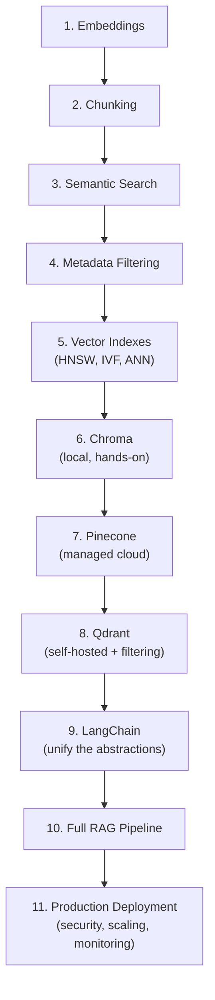

| Step | Focus | Suggested Exercise |
|---|---|---|
| 1. Embeddings | Understand what embeddings are and generate your first ones | Embed 5 sentences with OpenAI's API and print their vectors |
| 2. Chunking | Learn why and how to split documents | Chunk a long article with `RecursiveCharacterTextSplitter` and inspect the results |
| 3. Semantic Search | Compare keyword vs semantic search | Build a 10-line script that embeds a query and 5 documents, then ranks them by cosine similarity |
| 4. Metadata | Add structure to your vectors | Add category/date metadata and filter a search by it |
| 5. Vector Indexes | Understand ANN vs exact search | Read HNSW's core idea (Section 8.3) and identify which index type Chroma uses by default |
| 6. Chroma | Get hands-on with a local vector database | Build a tiny script that indexes 10 documents and searches them with Chroma |
| 7. Pinecone | Learn managed cloud vector search | Create a free Pinecone account, create an index, and repeat the exercise from step 6 |
| 8. Qdrant | Learn self-hosted deployment and rich filtering | Run Qdrant via Docker and repeat the exercise with payload filtering |
| 9. LangChain | Learn the unifying abstraction | Rebuild step 6's exercise using LangChain's `VectorStore` interface |
| 10. RAG | Combine retrieval with generation | Build a complete RAG script: embed -> store -> retrieve -> generate an answer with citations |
| 11. Production | Learn to secure, scale, and deploy | Wrap your RAG script in a FastAPI app, add auth, and deploy it (Section 20) |

> **Pace guidance:** most developers with basic Python experience can move
> through steps 1-6 in a single weekend. Steps 7-11 typically take longer,
> since they involve external services, infrastructure, and production
> concerns - budget a few weeks of part-time learning if this is new
> territory.

---

## 26. Further Resources

### Official Documentation

| Resource | Link |
|---|---|
| Chroma Docs | https://docs.trychroma.com |
| Pinecone Docs | https://docs.pinecone.io |
| Qdrant Docs | https://qdrant.tech/documentation/ |
| LangChain Docs | https://python.langchain.com/docs/introduction/ |
| OpenAI API Docs | https://platform.openai.com/docs |
| FastAPI Docs | https://fastapi.tiangolo.com |

### GitHub Repositories

| Repository | What it's useful for |
|---|---|
| `chroma-core/chroma` | Chroma's own source code - useful for understanding internals |
| `qdrant/qdrant` | Qdrant's Rust source code and example clients |
| `langchain-ai/langchain` | LangChain's core framework and integrations |
| `openai/openai-python` | Official OpenAI Python SDK source and examples |
| `facebookresearch/faiss` | The foundational library behind many ANN index implementations |

### Books

- *Designing Data-Intensive Applications* - Martin Kleppmann (deep,
  foundational systems design knowledge that applies directly to vector
  database architecture decisions)
- *Natural Language Processing with Transformers* - Lewis Tunstall, Leandro
  von Werra, Thomas Wolf (strong grounding in the models that produce
  embeddings)
- *Speech and Language Processing* - Daniel Jurafsky & James H. Martin
  (freely available draft chapters online; strong theoretical foundation)

### Research Papers

- *Efficient and Robust Approximate Nearest Neighbor Search Using
  Hierarchical Navigable Small World Graphs* (Malkov & Yashunin) - the
  original HNSW paper
- *Billion-scale similarity search with GPUs* (Johnson, Douze, Jégou) -
  foundational FAISS/IVF-PQ paper
- *Retrieval-Augmented Generation for Knowledge-Intensive NLP Tasks*
  (Lewis et al., Facebook AI Research) - the original RAG paper
- *Attention Is All You Need* (Vaswani et al.) - the Transformer paper
  underlying virtually all modern embedding and LLM models

### YouTube Channels

- **Andrej Karpathy** - deep, from-scratch explanations of neural network
  and language model fundamentals
- **StatQuest with Josh Starmer** - clear, beginner-friendly explanations
  of the statistics/ML concepts underlying embeddings
- **freeCodeCamp.org** - long-form practical tutorials, including FastAPI
  and vector database walkthroughs

### Courses

- **DeepLearning.AI short courses** (deeplearning.ai) - several focused,
  free/low-cost courses specifically on embeddings, vector databases, and
  RAG, often built with the vendors covered in this guide
- **Full Stack Deep Learning** (fullstackdeeplearning.com) - covers
  production ML system design, including retrieval systems

### Blogs

- **Pinecone's Learning Center** (pinecone.io/learn) - accessible,
  vendor-authored explainers on vector search concepts
- **Qdrant's Blog** (qdrant.tech/blog) - practical deep dives on indexing,
  filtering, and hybrid search
- **OpenAI's Blog** (openai.com/blog) - updates on embedding models and
  best practices from the model provider itself

---

*This guide is intended as a living reference - vector database features,
pricing, and best practices evolve quickly. Always cross-check specifics
(pricing, API signatures, default index types) against the official
documentation linked above before making production decisions.*
